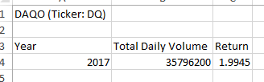
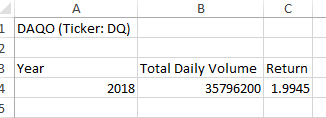
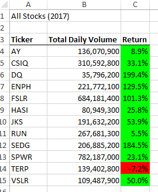
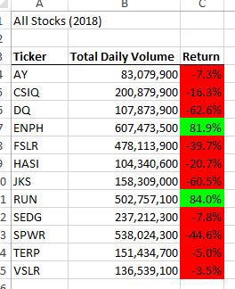
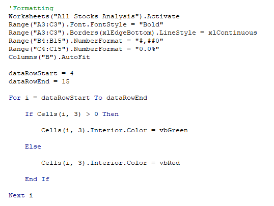

# Analyzing Stocks with VBA
## Overview of Stock_Analysis
### Steve, Steve's Parents, and DQ
Steve has asked for help, on behalf of his parents, for an analysis of green energy company DAQO (DQ). With their belief that alternative energy is the future, they want to invest in this specific market. Steve, being a good son, wants to make sure they have a diversified portfolio--all in the same green-energy vein--and has compiled 2017 and 2018 stock data to be able to best advise his parents and their investment decisions.
## Results
### DQ Analysis
 

We can see above, that DAQO had an average daily return of 1.99% in 2017.

Here, we see a an average daily return of -0.626% in 2018.
These are green flags and normal movements for stocks--average daily return is +/-1%. Steve should keep an eye on 2018 and the most current numbers, since we do not want negative returns.
### All Stocks Analysis

Wow! 2017 gave DAQO an almost 200% return--the highest return of all the stocks Steven is analyzing for the year! 

We could have predicted, based on the 2018 DQ Analysis, that DAQO's return for 2018 would be lower than that of 2017---62.6%. Unfortunately, this is the lowest return of all of Steve's tickers for the year. For Steve's parents to have the best chance at diversifying their investment in green-energy, they could consider also buying stock in ENPH and RUN. These companies both showed postive returns in 2017 and 2018--the only two companies that did so.
### Our Code
Thankfully, it is easy for us to identify these positive and negative returns based on our macro's script. Please see below the formatting code we wrote to be able to quickly identify these tickers.

## Summary
### Refactoring in General
It is time consuming to write code from scratch, and it is very helpful to quickly produce a final product when there is already a framework of code to work with. However, a disadvantage of refactoring code is the need to fit each piece of old code with each piece of new code--like a puzzle. Sometimes it's easy to add an output line but other times it is diffiult to align If statements to create the correct loops. 
### Our Original vs Refactored Script
The original script provided one large disadvantage--it is specific to this small data set. It worked quickly, but it did not have the power to run through so many tickers as Steve hopes to do in the future. The refactored code gives the ability to run through a larger dataset--albeit, the user will still have to hard code ticker names into the VBA script. This new code has a better capability of looping through a larger sheet with more rows.
